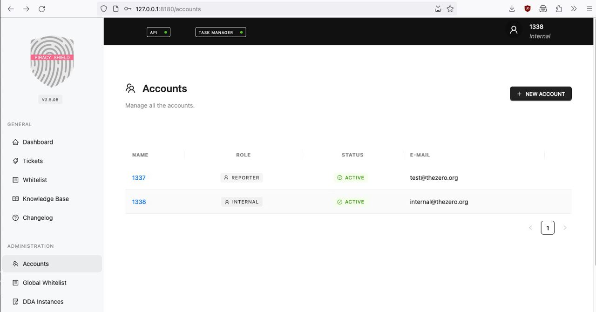

# docker-piracyshield
Docker files to run the leaked code of Piracy Shield



## What this project is NOT about

- This project is NOT a hack for Piracy Shield.
- This project is NOT a leak for Piracy Shield.
- This project DOES NOT contains copyrighted code for Piracy Shield and does not violates any copyright.
- This project is NOT affiliated with Piracy Shield, AGCOM, SP Tech Legal, or [fuckpiracyshield](https://github.com/fuckpiracyshield?tab=repositories).

## What this project is about

- This project is just an independent add-on to run the leaked Piracy Shield code inside a docker environment.
- This project is developed for educational and research purposes, and doesn't cause any harm whatsoever.
- This project source code are released under public domain and are free to use. Read the complete [LICENSE](./LICENSE)

## How to run

### Building the docker environment

Since we only have partial source code for Piracy Shield, we need to fix some parts

```bash
git clone https://github.com/TheZ3ro/docker-piracyshield/
cd docker-piracyshield

git clone --depth 1 https://github.com/fuckpiracyshield/frontend
git clone --depth 1 https://github.com/fuckpiracyshield/data
git clone --depth 1 https://github.com/fuckpiracyshield/api

mv frontend-Dockerfile frontend/Dockerfile

mv api-Dockerfile api/Dockerfile # yes, replace it
mv api-environment.sh api/environment.sh
mkdir -p api/data/apps
mkdir -p api/data/cache
mkdir -p api/data/configs
mkdir -p api/data/db
mkdir -p api/data/logs

cd api
mkdir libs
cd libs
git clone --depth 1 https://github.com/fuckpiracyshield/component
git clone --depth 1 https://github.com/fuckpiracyshield/data-model
git clone --depth 1 https://github.com/fuckpiracyshield/data-storage
git clone --depth 1 https://github.com/fuckpiracyshield/service
mkdir forensic # we miss this package, use a dummy one
cd ../..

docker compose build
docker compose up
```

### Getting the right config
In order to work, Piracy Shield needs a bunch of config files.
By running `config_dump.py` you can get a basic/minimal configuration.

```
pip3 install tomli-w
python3 config_dump.py 
```

### Configure the database

1. Visit http://127.0.0.1:8529
2. Login with `root`:`rootpassword`
3. Create a new database named `db`
4. Create a new user named `user` with password `user`
5. Grand admin privileges to `user` on `db`
6. Login as `user`
7. Create all the views and insert all the data. You are on your own on this.
